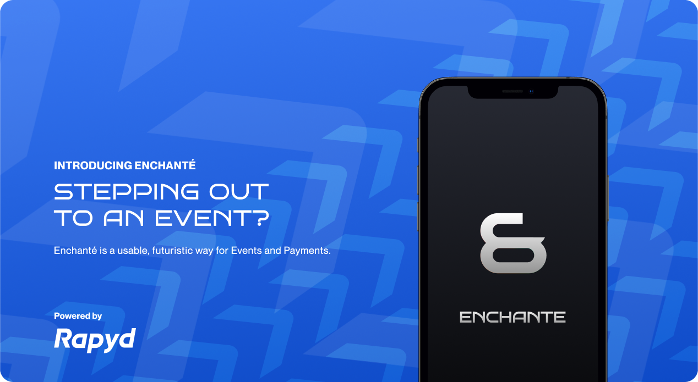
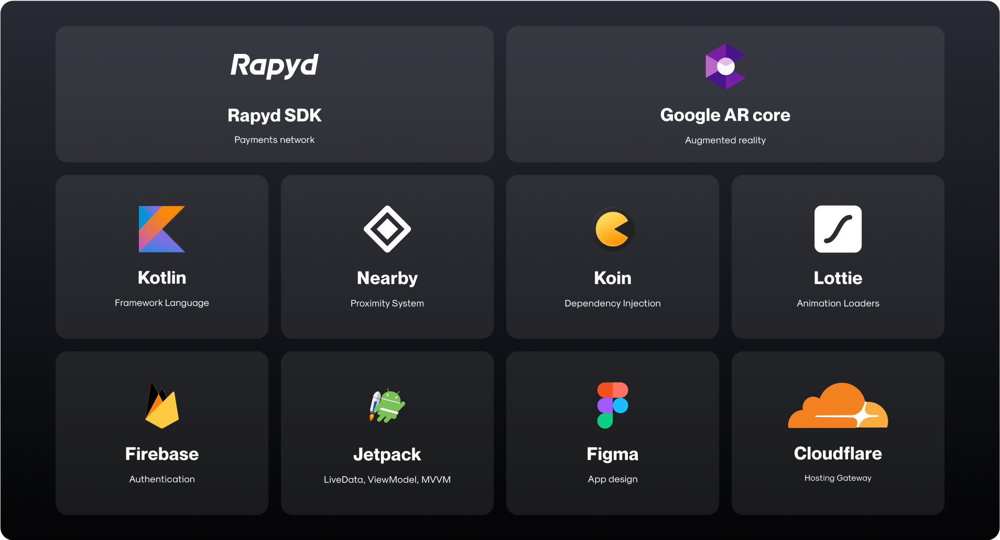
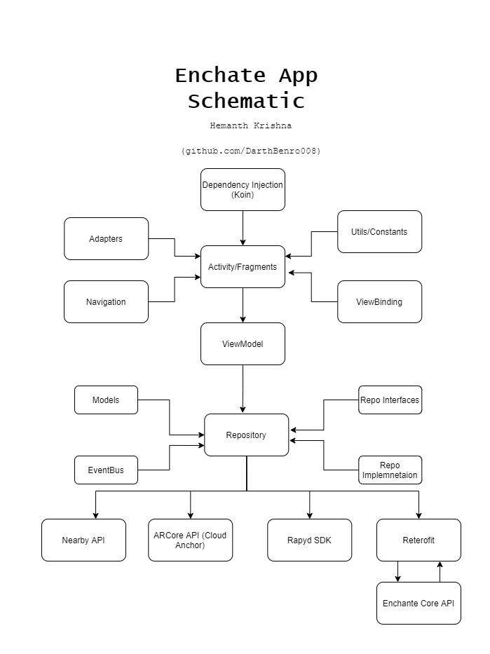

# Enchante App

> Reinventing transaction system using Augmented Reality and nearby Proximity

## What is Enchante?

We at Enchanté are reinventing the traditional transaction system and taking contactless payment to a whole new level by adopting bleeding-edge technology such as Augmented reality and nearby payments within eyesight.

Our primary features as of now are:

- Single Click Payment powered by Augmented Reality.
- Eazy navigation through the venue on the app where you can find other where attendees in the event are.
- Get personalized event recommendations and book them right from the app.
- Connect and remember people you met in an event without the hefty business cards

## TechStack



- Android App written in 100% Kotlin
- Uses Jetpack Components and AndroidX
- MVVM Architecture
- Koin Dependency Injection
- ARCore
- [Rapyd SDK](https://docs.rapyd.net/works-with/reference/rapyd-mobile-sdk-reference)

## Installation

- Clone the project

```bash
git clone https://github.com/EnchanteHQ/enchante
```

- Create a file named `secrets.xml` inside your `res/values` folder and populate it with [NearbyAPI](https://developers.google.com/nearby/messages/android/get-started) and [Rapyd Secrets](https://docs.rapyd.net/build-with-rapyd/docs) as follows

```xml
<?xml version="1.0" encoding="utf-8"?>
<resources>
    <string name="NEARBY_KEY">xxxxxx</string>
    <string name="RAPYD_ACCESS_KEY">zzzzzz</string>
    <string name="RAPYD_SECRET_KEY">yyyyyy</string>
</resources>
```

- Create your own Enchante API Hosting using [enchante-api](https://github.com/EnchanteHQ/core-api) API and get your API KEY, and place it inside quotes like shown below

```kotlin
package com.benrostudios.enchante.utils

object Constants {
    const val BASE_URL = "<ENCHANTE API URL>"
}
```

- Make sure to create a firebase project, enable OTP Authentication, Google Authentication and add the `google-services.json` in `app/src`

- Build and run the app using gradle

## Architecture and Structure

Enchante App uses MVVM Architecture as recommended by Google and takes full advantages of Jetpack Components such as LiveData, viewModelScopes and Coroutines. It additionally uses Koin for dependency Injection.

Do note that ARCore, NearbyAPI, and Rapyd SDK has been decoupled from the main repository app to allow scope of Unit and E2E testing in future



## Show your support

Give a ⭐ if you liked this project!

Spread the word to your fellows to help grow a healthy environment for us!

## Contributions

- Feel Free to Open a PR/Issue for any feature or bug(s).
- Make sure you follow the community guidelines!
- Feel free to open an issue to ask a question/discuss anything about Enchante App.
- Have a feature request? Open an Issue!


## Important Links

- [Landing Page](https://enchante.cf/)
- [Github Repositories](https://links.enchante.cf/github)
- [Postman API Documentation](https://documenter.getpostman.com/view/11033610/Tzm5JxSi#2b2e1dd6-1f04-4876-86fa-eb554e865128)
- [Figma Designs](https://links.enchante.cf/figma)

## License

Copyright 2021 EnchanteHQ

Licensed under MIT License : https://opensource.org/licenses/MIT

Use of [RapydSDK](https://docs.rapyd.net/works-with/reference/rapyd-mobile-sdk-reference) is propritery, and is designed for developers. This project does not distribute the SDK in anyway Use at your own risk with appropriate license and certification. 

<p align="center">Made with ❤ by Team Alpha</p>
